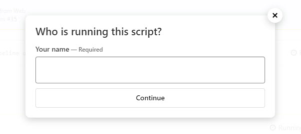

# Buildkite Input Step Example

This repository is an example [Buildkite](https://buildkite.com/) pipeline that asks for input in a build using an [Input Step](https://buildkite.com/docs/pipelines/input-step).

It includes:

* A [pipeline.yml](.buildkite/pipeline.yml) for defining a pipeline with input steps.
* A [script.sh](script.sh) (or [script.ps1](script.ps1)) script for processing the value from the input field. Edit the `pipeline.yml` to use your preferred script.

## Screenshot

## License

See [Licence.md](Licence.md) (MIT)
